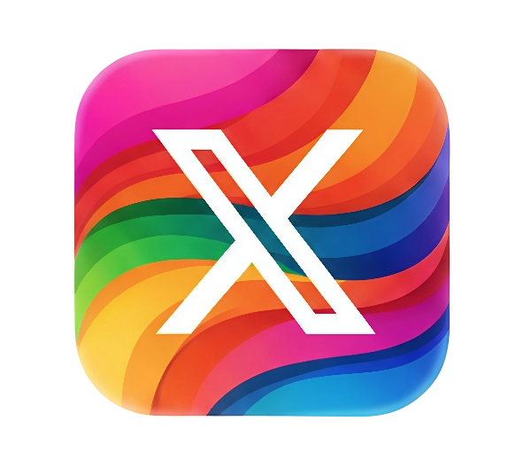

<h1 align="left">Hello World! I'm Amit Matth 👋</h1>

### 🚀 GSoC 2025 Contributor | Self-Taught Application Developer

- **🥇 GSoC 2025:** Proudly contributing to the **International Catrobat Association** on a **Flutter** project.
- **🧑‍💻 Core Expertise:** Building high-quality native **Android** and cross-platform **iOS** applications.
- **Modern Android:** Proficient in native Android development using **Kotlin**, **Java**, and modern UI with **Jetpack Compose**.
- **Cross-Platform:** Expertly crafting versatile apps with **Flutter**.
- **🌱 Current Focus:** Actively contributing to **Open Source** and embracing new development challenges.
- **🤝 Let's Connect:** I'm always open to discussing tech, collaborating on new ideas, or answering your mobile dev questions!

> **✨ Driven by Passion:** I'm a **Self-Taught Developer** my journey began right after 12th grade, driven by a pure passion for building.

## 🌐 Connect with Me:
  
 
  

## 🛠️ My Toolkit

  
  
  
  
  
  
  
  
  
  
  

